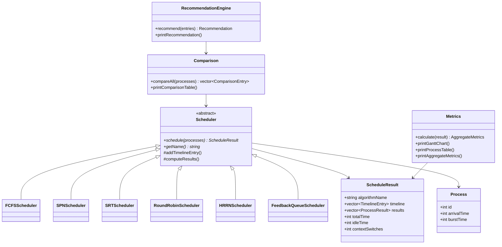

# CPU Scheduling Simulator

A comprehensive CPU scheduling simulator built in C++ that implements six different scheduling algorithms, compares their performance metrics, and provides algorithm recommendations based on workload characteristics.

## Overview

Modern operating systems must decide which process gets the CPU and for how long — this is the **CPU scheduling problem**. Different algorithms make different trade-offs between waiting time, response time, fairness, and overhead.

This simulator takes a set of processes as input, runs each scheduling algorithm on them, generates Gantt charts, calculates performance metrics, and recommends the best algorithm for the given workload.

## Features

- **6 Scheduling Algorithms**: FCFS, SPN/SJF, SRT/SRTF, Round Robin, HRRN, Multilevel Feedback Queue
- **Gantt Chart Generation**: Visual text-based execution timelines
- **Per-Process Metrics**: Completion, Turnaround, Waiting, and Response times
- **Aggregate Metrics**: Averages, CPU utilization, throughput, context switches, fairness index
- **Algorithm Comparison**: Side-by-side comparison table across all algorithms
- **Recommendation Engine**: Weighted heuristic scoring to suggest the best algorithm
- **Interactive CLI**: Manual process entry or sample datasets
- **Comprehensive Test Suite**: 24 tests with manually verified expected values

## Scheduling Algorithms

| Algorithm | Type | Selection Criterion | Starvation Risk |
|-----------|------|-------------------|-----------------|
| **FCFS** (First Come First Served) | Non-preemptive | Arrival order | None |
| **SPN** (Shortest Process Next) | Non-preemptive | Shortest burst time | High |
| **SRT** (Shortest Remaining Time) | Preemptive | Shortest remaining time | High |
| **Round Robin** | Preemptive | Time quantum rotation | None |
| **HRRN** (Highest Response Ratio Next) | Non-preemptive | Highest (wait+burst)/burst | None (built-in aging) |
| **Feedback Queue** (MLFQ) | Preemptive | Multi-level priority queues | Low (with aging) |

## Architecture



### OOP Design

| Principle | Application |
|-----------|-------------|
| **Abstraction** | `Scheduler` abstract base class defines the interface; implementation details hidden in subclasses |
| **Polymorphism** | All algorithms implement the same `schedule()` interface, enabling uniform comparison |
| **Encapsulation** | Each algorithm encapsulates its own scheduling logic and data structures |
| **Inheritance** | Concrete schedulers inherit from `Scheduler` and override `schedule()` and `getName()` |
| **Composition** | `Comparison` composes multiple `Scheduler` instances; `Metrics` operates on `ScheduleResult` |

### Data Structures Used

| STL Container | Where Used | Why |
|---------------|-----------|-----|
| `std::vector` | Process lists, results, timeline | Dynamic arrays with O(1) random access |
| `std::queue` | FCFS, RR, MLFQ ready queues | FIFO ordering, O(1) push/pop |
| `std::priority_queue` | SPN ready queue | O(log n) extraction of shortest burst |
| `std::map` | Recommendation scores | Ordered key-value storage for sorted output |
| Custom comparators | SPN priority queue, sorting | Tie-breaking by arrival time then process ID |

## Metrics & Formulas

### Per-Process Metrics

| Metric | Formula |
|--------|---------|
| **Completion Time (CT)** | Time when process finishes execution |
| **Turnaround Time (TAT)** | CT − Arrival Time |
| **Waiting Time (WT)** | TAT − Burst Time |
| **Response Time (RT)** | First CPU Time − Arrival Time |

### Aggregate Metrics

| Metric | Formula |
|--------|---------|
| **Avg Waiting Time** | Σ(WT) / n |
| **Avg Turnaround Time** | Σ(TAT) / n |
| **Avg Response Time** | Σ(RT) / n |
| **CPU Utilization** | (Total Time − Idle Time) / Total Time × 100% |
| **Throughput** | n / Total Time |
| **Fairness Index** | σ(Waiting Times) — standard deviation; lower = fairer |

## Recommendation System

The recommendation engine uses a **weighted scoring heuristic**:

1. **Normalize** each metric across all algorithms to [0, 1] (0 = best, 1 = worst)
2. **Apply weights**:
   - Average Waiting Time: **25%**
   - Average Turnaround Time: **20%**
   - Average Response Time: **20%**
   - Fairness (StdDev of WT): **15%**
   - CPU Utilization: **10%** (inverted — higher is better)
   - Context Switches: **10%**
3. **Sum** weighted scores — lowest total score = best overall algorithm

**Limitations**: This is a heuristic, not a definitive answer. The weights can be adjusted based on workload priorities (e.g., interactive systems should weight response time higher). The recommendation is specific to the given input workload.

## Project Structure

```
cpu-scheduling-simulator/
├── include/
│   ├── Process.h                  # Process data structure
│   ├── Scheduler.h                # Abstract base class + result types
│   ├── FCFSScheduler.h            # First Come First Served
│   ├── SPNScheduler.h             # Shortest Process Next
│   ├── SRTScheduler.h             # Shortest Remaining Time
│   ├── RoundRobinScheduler.h      # Round Robin
│   ├── HRRNScheduler.h            # Highest Response Ratio Next
│   ├── FeedbackQueueScheduler.h   # Multilevel Feedback Queue
│   ├── Metrics.h                  # Metrics calculation & display
│   ├── Comparison.h               # Cross-algorithm comparison
│   ├── Recommendation.h           # Recommendation engine
│   └── CLI.h                      # Command-line interface
├── src/
│   └── main.cpp                   # Entry point
├── tests/
│   └── test_schedulers.cpp        # 24-test comprehensive suite
├── examples/
│   ├── sample_processes.txt       # Sample input data
│   └── generate_sample_output.cpp # Output generator
├── Makefile
├── .gitignore
├── LICENSE
└── README.md
```

## Build Instructions

### Prerequisites

- **C++17** compatible compiler (GCC 7+, Clang 5+, MSVC 2017+)
- **Make** (optional, can compile manually)

### Build

```bash
# Clone the repository
git clone https://github.com/yourusername/cpu-scheduling-simulator.git
cd cpu-scheduling-simulator

# Option 1: Using Make
make

# Option 2: Direct compilation
mkdir -p bin
g++ -std=c++17 -Wall -Wextra -Iinclude -o bin/scheduler src/main.cpp
```

### Run

```bash
./bin/scheduler       # Linux/macOS
.\bin\scheduler.exe   # Windows
```

### Test

```bash
# Option 1: Using Make
make test

# Option 2: Direct compilation
g++ -std=c++17 -Wall -Wextra -Iinclude -o bin/test_scheduler tests/test_schedulers.cpp
./bin/test_scheduler
```

## Sample Output

### Gantt Chart (FCFS)

```
--- Gantt Chart (FCFS) ---
|---P1---|---P2---|---P3---|---P4---|---P5---|
0         6       10       12       15       20
```

### Process Table

```
PID  Arrival   Burst     Completion  Turnaround  Waiting   Response
---------------------------------------------------------------------
1    0         6         6           6           0         0
2    1         4         10          9           5         5
3    2         2         12          10          8         8
4    3         3         15          12          9         9
5    5         5         20          15          10        10
```

### Comparison Table

```
Algorithm                Avg WT    Avg TAT   Avg RT    CPU Util(%) Ctx Switches   Fairness
--------------------------------------------------------------------------------------------
FCFS                     6.40      10.40     6.40      100.00      4              3.61
SPN                      5.80      9.80      5.80      100.00      4              3.82
SRT                      5.00      9.00      2.80      100.00      6              3.90
Round Robin (q=2)        8.00      12.00     3.00      100.00      9              3.29
HRRN                     6.00      10.00     6.00      100.00      4              3.63
Feedback Queue (q=1,2,4) 9.20      13.20     0.20      100.00      12             2.79
```

### Recommendation

```
Category Winners:
  Best Waiting Time    : SRT
  Best Turnaround Time : SRT
  Best Response Time   : Feedback Queue (q=1,2,4)
  Least Context Switch : FCFS
  Best Fairness        : Feedback Queue (q=1,2,4)

*** BEST OVERALL ALGORITHM: SRT ***
```

## Complexity Analysis

| Algorithm | Decision Complexity | Overall | Data Structure |
|-----------|-------------------|---------|----------------|
| FCFS | O(1) | O(n) | `queue` |
| SPN | O(log n) | O(n log n) | `priority_queue` |
| SRT | O(n) per event | O(n²) worst case | Linear scan |
| Round Robin | O(1) | O(Σbursts / quantum) | `queue` |
| HRRN | O(n) | O(n²) | Linear scan |
| Feedback Queue | O(k) per decision | O(n × k × max_q) | k `queue`s |

Where n = number of processes, k = number of queue levels.

## Design Decisions

1. **Header-only algorithm implementations**: Each scheduler is fully implemented in its header file, reducing build complexity while maintaining modularity. The single-compilation-unit approach is appropriate for this project size.

2. **Immutable input**: `schedule()` takes `const std::vector<Process>&` — algorithms never modify the original process list, enabling safe comparison across algorithms.

3. **Value semantics for results**: `ScheduleResult` is returned by value, making each algorithm's results independent with no shared mutable state.

4. **Base class helpers**: `addTimelineEntry()` merges adjacent same-process segments automatically. `computeResults()` calculates metrics uniformly, avoiding per-algorithm metric bugs.

5. **Event-driven simulation (SRT)**: Instead of tick-by-tick simulation, SRT jumps between events (arrivals and completions) for better performance.

6. **No preemption mid-quantum for MLFQ**: The Feedback Queue implementation does not preempt a running process mid-quantum when a higher-priority arrival occurs. Preemption happens only at quantum boundaries. This simplifies implementation and is a common MLFQ variant.

## Testing

The test suite includes 24 tests:

| Category | Tests |
|----------|-------|
| Empty/single process | 3 tests |
| Algorithm correctness | 6 tests (one per algorithm, manually verified) |
| Edge cases | 7 tests (same arrivals, idle gaps, same bursts, quantum extremes, etc.) |
| Metrics & modules | 4 tests (metrics math, comparison, recommendation, invariants) |
| Stress tests | 2 tests (large workload, starvation scenario) |
| Integrity checks | 2 tests (Gantt chart contiguity, TAT = WT + BT invariant) |

All expected values are **manually calculated and verified** against textbook examples.

## Limitations

1. **Single-core simulation only** — does not support multiprocessor scheduling
2. **No I/O bursts** — processes have a single CPU burst (no I/O wait simulation)
3. **Known burst times** — burst times are provided as input, not estimated
4. **No priority scheduling** — priorities are not a separate input parameter
5. **Integer time units** — time is discrete (integer), not continuous
6. **Context switch time = 0** — context switch overhead is tracked but not added to simulation time

## Future Improvements

- Add multicore scheduling simulation
- Add I/O burst simulation with waiting queues
- Add priority-based scheduling algorithms
- Add configurable context switch overhead
- Add burst time estimation using exponential averaging
- Add file-based input/output
- Add graphical Gantt chart rendering
- Add aging mechanism for MLFQ

## License

This project is licensed under the MIT License — see the [LICENSE](LICENSE) file for details.
